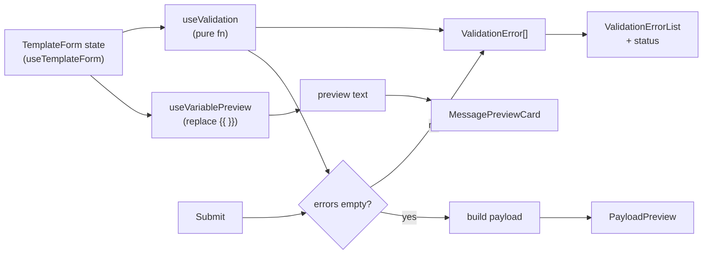

# Message Template Editor — Build Plan

A pure frontend Vue 3 SPA. No backend, mock data only. Budget: 3–5 hours.
Graded on: feature completeness, code structure, TS quality, validation design,
AI-assisted judgment, edge-case awareness, maintainability.

---

## Tech Stack (locked)

| Layer | Choice | Why |
|---|---|---|
| Build | Vite (vue-ts template) | Vue 3 default, zero config |
| Framework | Vue 3 `<script setup lang="ts">` | Required; the idiomatic Composition API form |
| UI | shadcn-vue (Tailwind + primitives) | Components are copied into the repo: owned, explainable, not a black box |
| State | refs + composables, no Pinia | Single screen, no cross-component complex state |
| Testing | Vitest | Same toolchain as Vite; targets the pure `validate()` function |
| Lint | ESLint + Prettier | Cheap win for code readability |
| Deploy | GitHub Pages (Actions) | Zero cost, zero maintenance, click-to-view for the reviewer |

**Deliberately excluded:** Pinia / vue-router / heavy UI kits. Adding them would be an over-engineering signal.

---

## Data flow



Core loop: editing the form recomputes validation and preview live. Submit just re-checks and builds the payload.

## Component tree

```
MessageTemplateEditor            // container, holds form state
├── TemplateBasicForm            // Name / Channel / Language / Title
├── MessageContentEditor         // textarea (cursor-insertion target)
│   └── VariableInsertToolbar     // variable buttons, insert at caret
├── MessagePreviewCard           // channel bubble / title / substituted text / status
├── ValidationErrorList          // error list
└── PayloadPreview               // submitted payload JSON
```

---

## Payload shape (self-designed: reasonable + extensible)

```ts
type SubmitPayload = {
  name: string
  channel: Channel
  language: Language
  title?: string
  content: string          // raw template, keeps {{ }}
  variables: string[]      // variables actually used in the content
  meta: {
    contentLength: number
    createdAt: string      // time of submit
  }
}
```

Keeping content raw (with variables) is deliberate: the backend is where values are filled per recipient, so the frontend does not render them in early.

---

## Validation rules (the core; all in one pure function)

| Rule | Condition | Message |
|---|---|---|
| Name required | `name.trim()` empty | Template name is required |
| Channel required | not selected | Channel is required |
| Content required | `content.trim()` empty | Message content is required |
| Content ≤ 500 | `content.length > 500` | Message content cannot exceed 500 characters |
| Unknown variable | `{{ x }}` where x is not supported | Unknown variable: x |
| Invalid syntax | unbalanced braces | Invalid variable syntax |
| WhatsApp spaces | WhatsApp channel + 6+ consecutive spaces | WhatsApp message cannot contain more than 5 consecutive spaces |

Detection: scan each brace cluster (`/\{+[^{}]*\}+|\{+|\}+/`) and classify it — valid token, unknown
variable, invalid variable name, or invalid syntax. Channel rules live in a table (`Record<Channel, Rule[]>`)
so new channels extend without touching the core flow.

**Decisions to document in the README:**
- 500 chars counts the raw content (including `{{ }}`), not the substituted output.
- A stray brace is always treated as invalid syntax (including a lone `{` the user meant literally).
- Language required conflict (PDF p.3 vs p.11): follow the Validation Rules section, treat Language as optional, default `zh-TW` → shipped as `en`.
- Language selects the preview's mock value set (localized), but has no validation rule.

---

## Step-by-step (~4 hour plan)

- **P0 · Scaffold ~40m** — `create vite` vue-ts → shadcn-vue init → `add` button/input/select/textarea/card/label → vitest + eslint/prettier → confirm dev server runs.
- **P1 · Types & mock ~15m** — `types.ts` (Channel/Language/TemplateForm/ValidationError/SubmitPayload), `mockValues`, `SUPPORTED_VARIABLES`.
- **P2 · useValidation + tests ~60m** — pure function first, Vitest against the table above (incl. the malformed examples). The score sits here; do it first.
- **P3 · preview + form state ~30m** — `useVariablePreview` (regex replace), `useTemplateForm` (ref state).
- **P4 · Components ~80m** — the six components; VariableInsertToolbar does caret-position insertion (textarea selectionStart, a bonus).
- **P5 · Wire + submit ~30m** — assemble MessageTemplateEditor; `submitTemplate(payload): Promise` fake async; invalid blocks, valid prints the payload.
- **P6 · Polish + README + deploy ~40m** — light responsive; README (checklist below); set `base` + Actions deploy to Pages.

Ordering principle: types → core validation (TDD) → logic composables → UI → wiring → polish. UI last, because the score is in the logic, not the pixels.

---

## GitHub Pages deploy

Set `base: '/'` in `vite.config.ts` (served at the subdomain root, mte.jialin00.com).
Actions: build → `actions/deploy-pages` (or peaceiris to the serving repo). Single page, no router, so no SPA 404 fallback needed.

---

## README checklist (fill at the end)

Required by the spec:
- [ ] How to run (`npm i` / `npm run dev` / `npm run test`)
- [ ] Architecture design + component structure
- [ ] Validation logic design (the classify scan + channel table)
- [ ] AI usage notes (below)
- [ ] Known limitations
- [ ] What you'd improve with more time
- [ ] Trade-offs: why shadcn-vue, why raw content in the payload, 500 counts raw, Language has no validation, plain textarea over rich text

AI usage (five prompts):
- [ ] Which AI tools were used
- [ ] How (requirement breakdown / components / validation / regex / tests / README / code review)
- [ ] 2–5 key prompts
- [ ] ≥2 AI suggestions not adopted (e.g. rejected an EC2 backend, rejected a rich text editor)
- [ ] How AI output was verified (Vitest on the validation fn, type check, per-rule edge cases)

---

## Additions (backlog — deferred, not required by the spec)

Parked enhancements, in priority order:

1. **Channel realism** — make each preview look more like the real app: LINE rounded bubbles, Messenger avatar, timestamp + read receipts. Colours and the channel bar already differ per channel; this is the next fidelity layer.
2. **Save template to localStorage** — persist submitted templates locally, list them, click to reload into the form. Simulates a template library without a backend. The spec does not require persistence (submit only needs to display the payload), so this is a bonus that reinforces the "save a template, not send a message" model.
