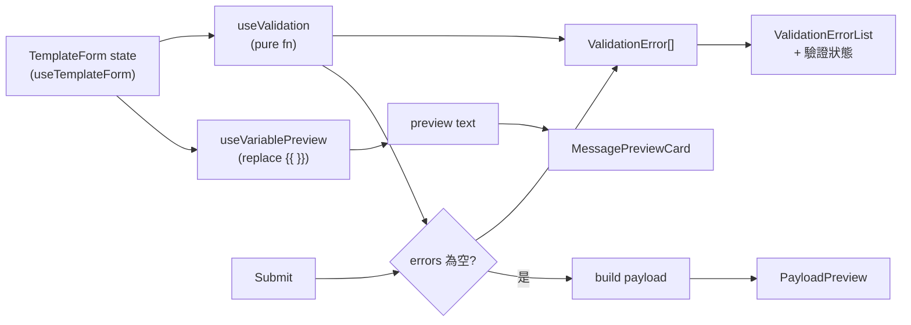

# Message Template Editor — Build Plan

Omnichat Senior FE assignment. 純前端 Vue 3 SPA,無後端,mock data。預算 3–5 小時。
評分軸:feature completeness / code structure / TS quality / validation design / AI-assisted 判斷 / edge case / maintainability。

---

## Tech Stack(鎖定)

| 層 | 選擇 | 理由 |
|---|---|---|
| Build | Vite (vue-ts 樣板) | Vue 3 預設,零設定 |
| 框架 | Vue 3 `<script setup lang="ts">` | 規格指定,Composition API 最地道形式 |
| UI | shadcn-vue (Tailwind + primitives) | 元件 copy-in 進 repo,自己擁有、可解釋,不是黑箱 |
| 狀態 | ref + composables,無 Pinia | 單頁,沒有跨組件複雜狀態 |
| 測試 | Vitest | 跟 Vite 同源,專打 `validate()` 純函式 |
| Lint | ESLint + Prettier | 低成本吃 code readability |
| 部署 | GitHub Pages (Actions) | 零成本零維護,reviewer 點連結即看 |

**明確不加:** Pinia / vue-router / 重量級 UI 全家桶。加了是 over-engineer 的反訊號。

---

## 資料流



核心一條:動 form → validation 跟 preview 即時重算。submit 只是再擋一次 + 組 payload。

## Component 樹

```
MessageTemplateEditor            // 容器,持有 form state
├── TemplateBasicForm            // Name / Channel / Language / Title
├── MessageContentEditor         // textarea(游標插入的目標)
│   └── VariableInsertToolbar     // 變數按鈕,插在游標位置
├── MessagePreviewCard           // channel / title / 代值後訊息 / 驗證狀態
├── ValidationErrorList          // 錯誤清單
└── PayloadPreview               // submit 成功後的 payload JSON
```

---

## Payload 形狀(自訂,求 reasonable + extensible)

```ts
type SubmitPayload = {
  name: string
  channel: Channel
  language: Language
  title?: string
  content: string          // 原始模板,保留 {{ }}
  variables: string[]      // 內容中實際用到的變數
  meta: {
    contentLength: number
    createdAt: string      // submit 當下時間
  }
}
```

保留原始 content(含變數)是刻意的:後端才是真正填值群發的地方,前端不該提前 render 死。

---

## 驗證規則(核心,全進一個純函式)

| 規則 | 條件 | 訊息 |
|---|---|---|
| Name 必填 | `name.trim()` 空 | Template name is required |
| Channel 必填 | 未選 | Channel is required |
| Content 必填 | `content.trim()` 空 | Message content is required |
| Content ≤ 500 | `content.length > 500` | Message content cannot exceed 500 characters |
| 未知變數 | `{{ x }}` 的 x 不在支援清單 | Unknown variable: x |
| 語法錯誤 | 括號不成對 | Invalid variable syntax |
| WhatsApp 空白 | 選 WhatsApp 且 6+ 連續空白 | WhatsApp message cannot contain more than 5 consecutive spaces |

偵測法(兩步):
1. 用 `/\{\{\s*(\w+)\s*\}\}/g` 撈合法 token,名字不在 `['customer_name','order_id','shop_name']` → 未知變數。
2. 把合法 token 挖掉,若字串裡還剩 `{` 或 `}` → 語法錯。

channel 規則做成 table(`Record<Channel, Rule[]>`),WhatsApp 那條掛在表裡,未來加規則不動主流程 = 可擴充加分項。

**要在 README 交代的決定:**
- 500 字算原始內容(含 `{{ }}`),不是替換後。
- 落單括號一律當語法錯(含使用者只想打一個 `{`)。
- Language 必填衝突(規格第 3 頁 vs 第 11 頁):跟「驗證規則」節走,當非必填、預設 zh-TW。
- Language 只進 payload、無行為,保留給未來 locale 規則。

---

## Step-by-step(約 4 小時排法)

- **P0 · Scaffold ~40m** — `create vite` vue-ts → shadcn-vue init → `add` button/input/select/textarea/card/label → 裝 vitest + eslint/prettier → 確認 dev server 起得來。
- **P1 · Types & mock ~15m** — `types.ts`(Channel/Language/TemplateForm/ValidationError/SubmitPayload)、`mockValues`、`SUPPORTED_VARIABLES`。
- **P2 · useValidation + 測試 ~60m** — 純函式先寫,Vitest 對著上面那張表逐條打(含兩個壞例子)。這是分數重心,先做。
- **P3 · preview + form state ~30m** — `useVariablePreview`(regex replace)、`useTemplateForm`(ref state)。
- **P4 · Components ~80m** — 六個 component;VariableInsertToolbar 做游標位置插入(textarea selectionStart,加分)。
- **P5 · Wire + submit ~30m** — 組 MessageTemplateEditor;`submitTemplate(payload): Promise` 假 async(延遲 + 隨機成敗);invalid 擋、valid 印 payload。
- **P6 · Polish + README + deploy ~40m** — 輕度 RWD;寫 README(下方檢查表);設 `base` + Actions 部署 Pages。

順序原則:型別 → 核心驗證(TDD)→ 邏輯 composables → UI → 串接 → 收尾。UI 最後,因為分數在邏輯不在畫面。

---

## GitHub Pages 部署

`vite.config.ts` 設 `base: '/<repo-name>/'`(結尾斜線別漏),否則 asset 404。
Actions:build → `actions/deploy-pages`。單頁無 router,不需要 SPA 404 fallback。

---

## README 檢查表(收尾一次補齊)

規格要的:
- [ ] How to run(`npm i` / `npm run dev` / `npm run test`)
- [ ] Architecture design + Component structure
- [ ] Validation logic design(貼那兩步偵測 + channel table)
- [ ] AI usage notes(見下)
- [ ] Known limitations
- [ ] What you'd improve with more time
- [ ] 技術取捨:shadcn-vue 為何選、payload 為何留原始 content、500 算原始、Language 無行為、純 textarea 不做 rich text

AI 使用五題:
- [ ] 用了哪些 AI 工具
- [ ] 怎麼用(需求拆解 / component / validation / regex / 測試 / README / code review)
- [ ] 2–5 個關鍵 prompt
- [ ] ≥2 個沒直接採用的 AI 建議(例:擋掉 EC2 後端、擋掉 rich text editor)
- [ ] 怎麼驗證 AI 產出(Vitest 對驗證函式、type check、逐條 edge case)

---

## Additions(backlog,延後、非規格必需)

停在這裡的加分項,按優先序:

1. **Channel 擬真細節** — 讓每個 channel 的 preview 更像真 app:LINE 圓角氣泡、Messenger 頭像、時間戳 + 已讀勾勾。目前顏色 + 頻道 bar 已能分辨 channel,這是下一層擬真。
2. **localStorage 存 template** — submit 過的存進 localStorage、列清單、點了載回表單。沒後端也能模擬範本庫。規格不要求 persist(submit 只需顯示 payload),所以這是加分,順便補強「存模板、不是發訊息」的產品語意。
